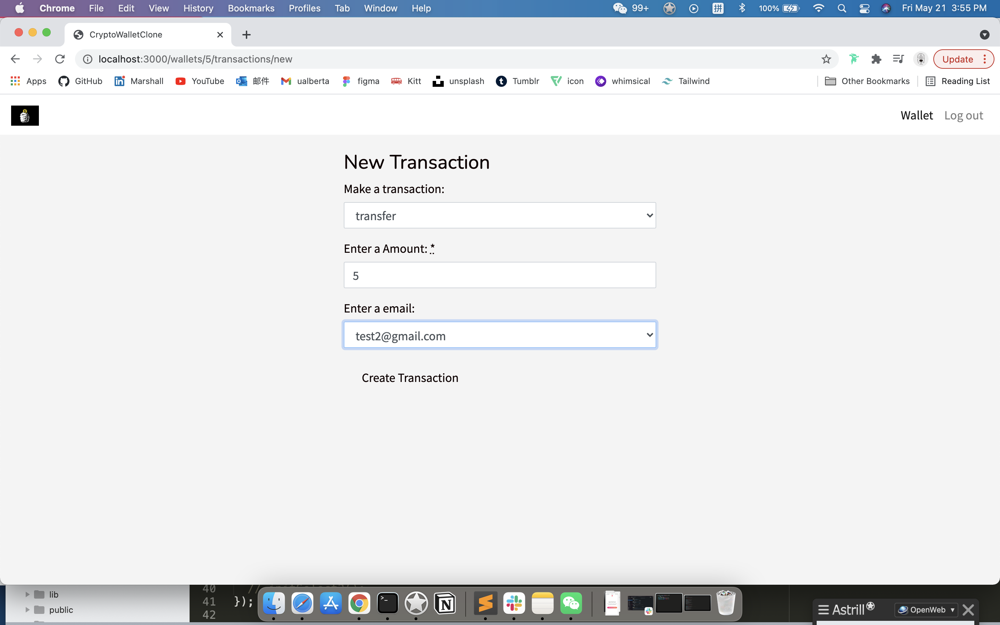

# Cpypto-Wallet-Clone

This is a crypto wallet clone web app.

This application helps user organise their money, they can deposit/withdraw money from the wallet, they can transfer money to another user.

The Rails application has been generated using Le Wagon [Rails Template](https://github.com/lewagon/rails-templates) to make development easier, faster, cleaner and customizable.


## Technologies Used
 - Generated using [Rails](https://rubyonrails.org/)
 - [Bootstrap](https://getbootstrap.com/) for the tiny styling
 - [JavaScript](https://developer.mozilla.org/en-US/docs/Web/JavaScript) for the transaction new page, user can see the email options when they select transfer
 - [PostgreSql](https://www.postgresql.org/) for database

Gems

 - [Devise](https://github.com/heartcombo/devise) for user authentication
 - [Pundit](https://github.com/varvet/pundit) for user can only edit/make transactions on their own wallet
 - [simple_form](https://github.com/heartcombo/simple_form) for user input

## Features
As a User:
- I can create a wallet (Each user can only one wallet for the real world case)
- I can edit the name of my own wallet
- I can deposit money to my own wallet
- I can withdraw money from my own wallet
- I can transfer money to another user's wallet
- I can receive money from another user
- I can see all transaction history belongs to my own wallet

As an Admin:
- I can see all the users' wallets
- I can see all the users' transactions


## Screenshot
WebApp screenshot
User login:

Wallet:

Withdraw:

Transfer:

Transactions:


## Setup

Unzip crypto-wallet-clone.zip file

on your terminal
```
cd crypto-wallet-clone
```

Install dependencies

```
bundle install
```

```
rails s
```

open another tab

```
webpack-dev-server
```

Browser

```
http://localhost:3000/
```

Test account
```
marshall@gmail.com 123456 (admin user)
```
```
test1@gmail.com 123456
```
```
test2@gmail.com 123456
```

## Structure

Crypto-Wallet-Clone is base on the MVC architectural pattern.

Models are in the ```app/models ```
  - user:  ```app/models/user.rb```
  - wallet: ```app/models/wallet.rb```
  - transaction: ```app/models/transaction.rb```

Views are in the ```app/views```
  - devise: ```app/views/devise```
  - wallets: ```app/views/wallets```
  - transactions: ```app/views/transactions```

Controllers are in the ```app/controllers```
  - wallets: ```app/controllers/wallets_controller.rb```
  - transactions: ```app/controllers/transactions_controller.rb```

Pundit_Policy: ```app/policies```

Schema: ```db/schema.rb```

CSS: ```app/assets``` folder:

JavaScript: ```app/javascript/components``` folder.

## Coming features

To do:
- Improve the Rails Automated Testing
- Improve the Frontend

